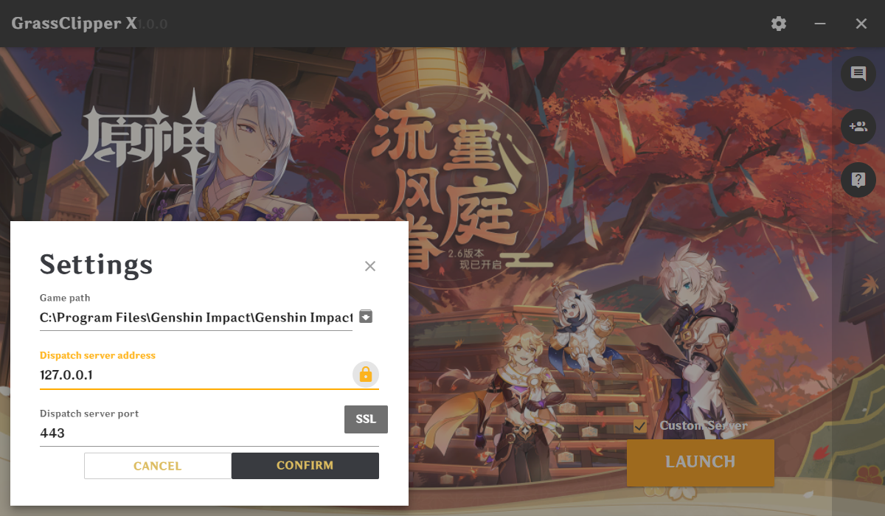

## Archival Notice
GrassClipper-X is **closed source** and has not been updated in quite a while.\
Consider using GrassClipper by SpikeHD or wait for Cultivation by SpikeHD & KingRainbow44.

# GrassClipper X
A MiHoYo-like launcher for custom servers, better UI &amp; insensible proxy.

## How to use
1. Download launcher from official website ([CNREL](https://ys.mihoyo.com/) [OSREL](https://genshin.hoyoverse.com/))
2. Download game in official launcher
3. Download GrassClipper X, extract to somewhere and run `GrassClipper.exe`
4. Select game executable (NOT launcher! Usually as `YuanShen.exe` or `GenshinImpact.exe` under `<launcher_path>/Genshen Impact Game`) and fill custom server fields in settings
5. Check `Custom Server` in the main interface, then click `LAUNCH`
6. Have fun :)

## TODO
- [x] More beautiful MiHoYo-like UI
- [x] Configuration storage
- [x] Insensible local proxy daemon
    - [x] Proxy game traffic
    - [x] Background only proxy
    - [x] Release traffic for other applications
    - [ ] Enable proxy for games only
    - [ ] External proxy
- [x] Custom server options
    - [x] Switch between official and custom
    - [x] IP & Port
    - [x] SSL switch
    - [ ] Multi server switch
    - [ ] Registration and login (Wait for Grasscutter to implement)
- [ ] Internationalization
    - [ ] Languages
    - [ ] Game logo
- [ ] Custom background image
- [ ] Restart after the game exited
- [ ] News tabs
- [ ] Platform support
    - [x] Windows X64
    - [ ] Windows X86
    - [ ] Linux X64
    - [ ] Linux X86
    - [ ] macOS (?)
    - [ ] Android (?)
    - [ ] iOS (?)
    
Any feature requests? Please let me know in [issues](https://github.com/Grasscutters/GrassClipper-X/issues).

## Known issues
- [ ] Side button not working
- [ ] A display error will appear after selecting the game path

Any other problems? Please let me know in [issues](https://github.com/Grasscutters/GrassClipper-X/issues).

## Screenshots

## Copyright
Create with love. ❤

Copyright © 2002-2022 [MlgmXyysd](https://www.neko.ink/) All Rights Reserved.

> "MiHoYo Mark", "YuanShen logo" and "Genshin Impact logo" are registered trademarks or trademarks of Shanghai MiHoYo YingTie Technology Co., Ltd. All other trademarks are the property of their respective owners. Background intercepted from "Genshen Impact", all used as is. Some icon or image materials used in this software belong to the corresponding copyright owners. The software is provided to the user free of charge and as is. This software will not make any changes to any game files. Any possible legal risk arising from the use of the software by the user is at the user's own risk. Users may not attempt to obtain the source code of the program by decompiling, disassembling or other means without permission. This software is not related to "GlassClipper" (another project with the same name).

For other directly referenced third-party libraries, they are used under the license of their respective agreements:

- jQuery JavaScript Library v3.6.0: https://jquery.org/license
- mdui v1.0.1: https://github.com/zdhxiong/mdui/blob/v1/LICENSE
- NW.js v0.63.1: https://github.com/nwjs/nw.js/blob/nw63/LICENSE
